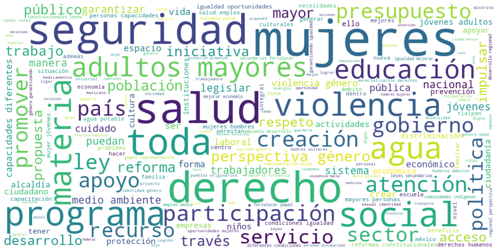
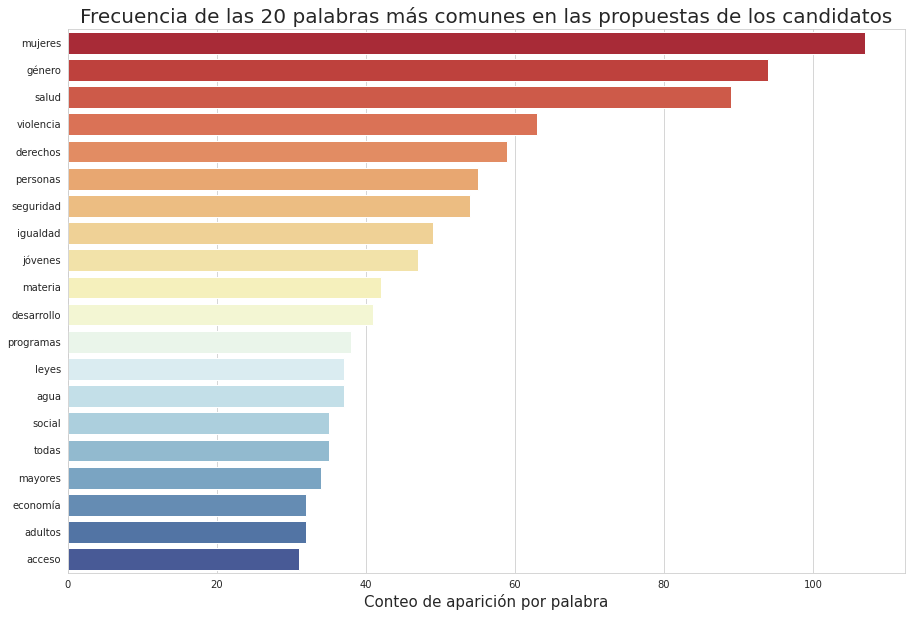
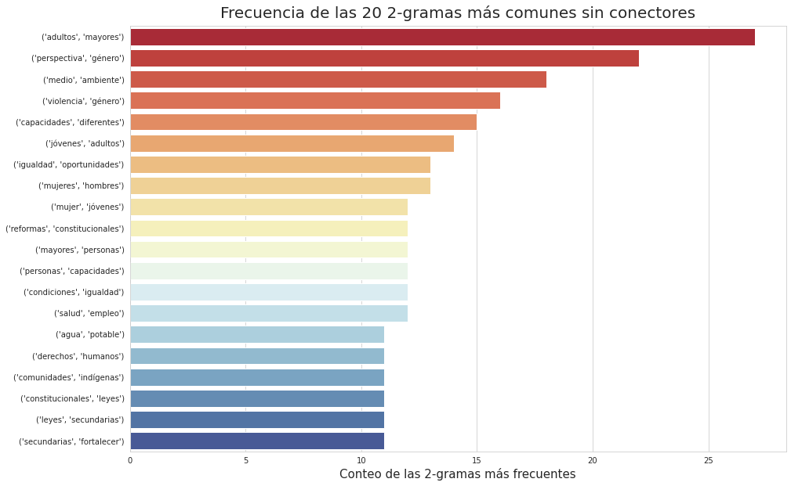

# :round_pushpin: Analisis_INE_2021 
## Análisis a las candidaturas por diputación en el año 2021 MX.

Este analisis tiene como finalidad dar un panorama general acerca del discurso político enunciado en las propuestas de campaña de las candidatas y candidatos a diputación en la república mexicana. Además de acercar las propuestas de los ya mencionados, por número de distrito y entidad federativa, a quien lo desee, con la finalidad de informar acerca de éstas

A partir de los datos se pueden obtener gráficas como los siguientes: 

A partir de los cuales podemos obtener un panorama general de las propuestas realizadas en la CDMX, por ejemplo. 

Además de estas gráficas, también podemos obtener un archivo `csv` con todas las propuestas realizadas por los candidatos al momento de registrarse a la base de datos del INE. 

- [Propuestas de las candidatas y candidatos a diputación](DAT/)
